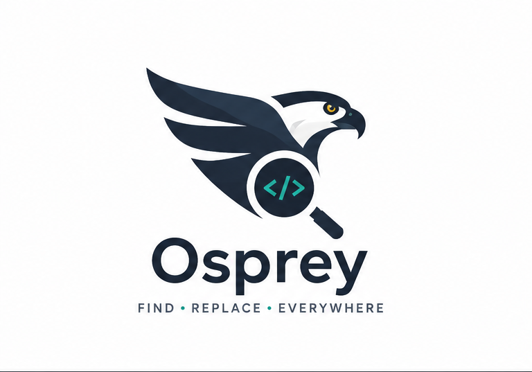
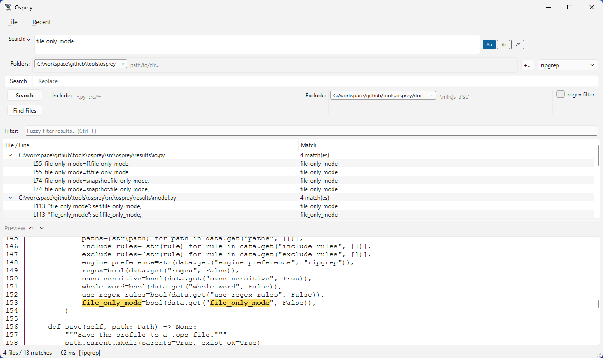
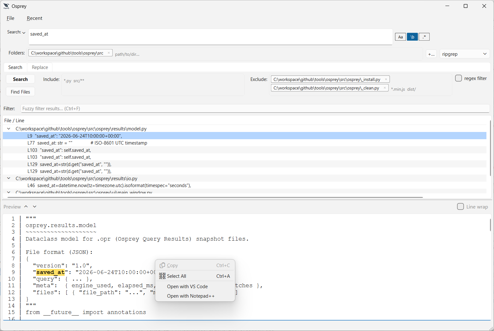
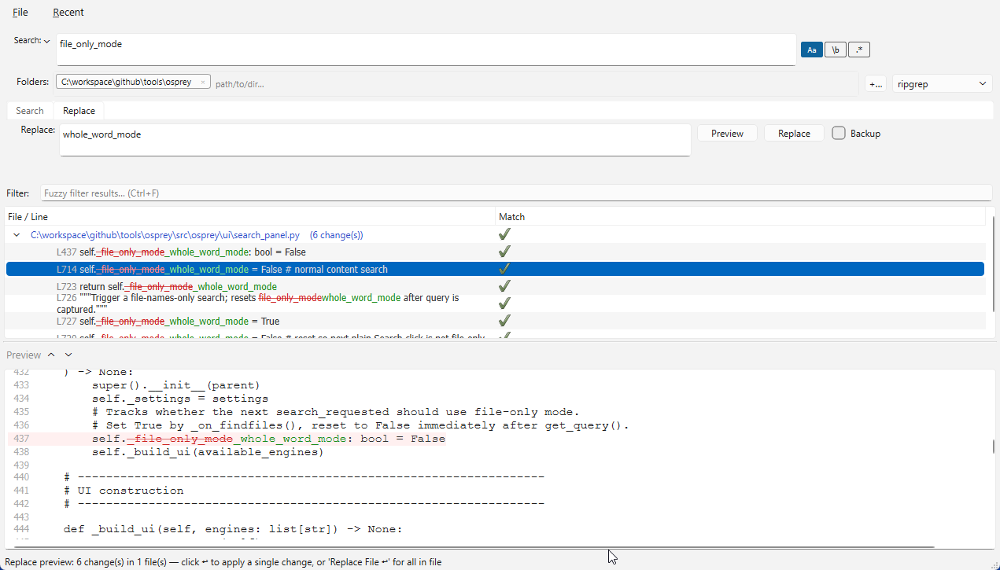
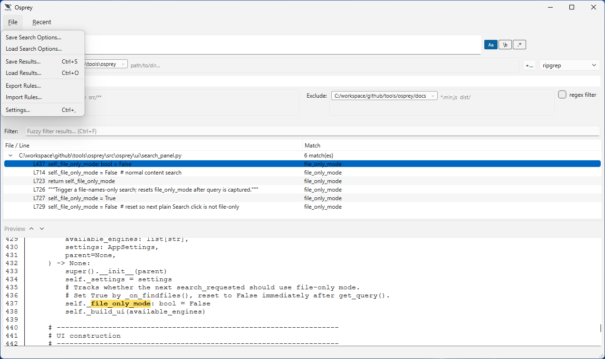
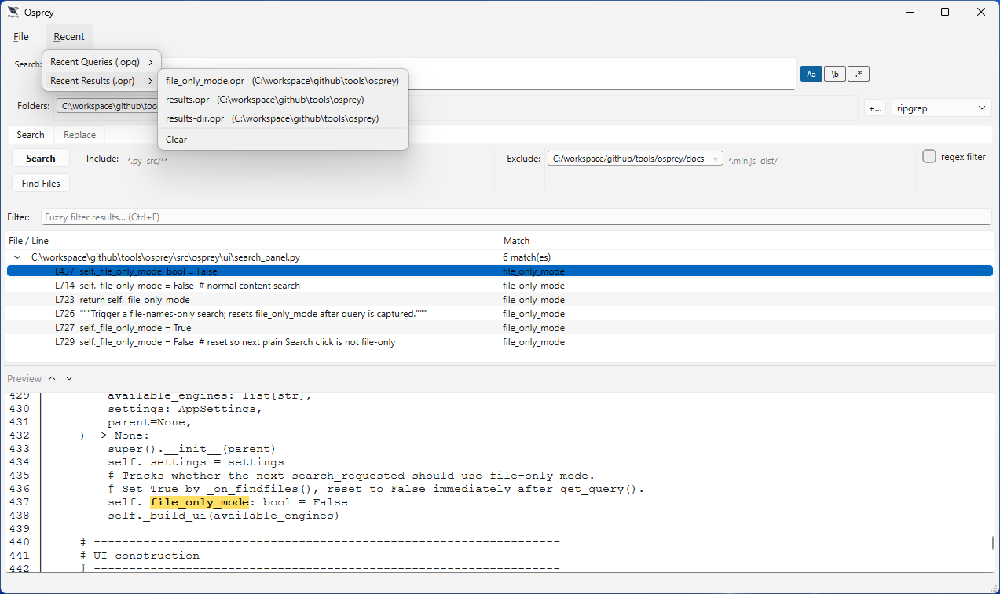
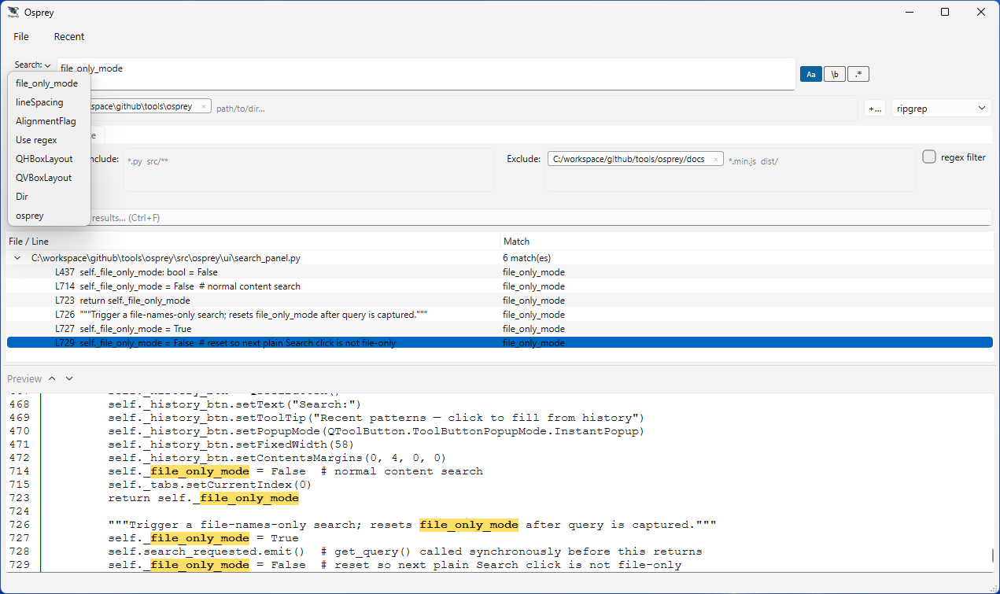
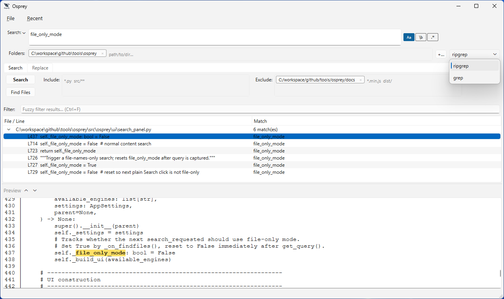

<p align="center">
  
</p>


<p align="center">A fast, powerful, cross-platform desktop GUI for searching and replacing text across large codebases.</p>

<p align="center">
  <a href="https://github.com/petercai/osprey/releases/latest"></a>
  
  
  
  <a href="https://github.com/petercai/osprey/stargazers"></a>
</p>

## Why Osprey

Modern IDEs bundle a "find in files" panel, and terminal tools like `ripgrep` are blazing fast — but neither is a great fit when you need to search and edit across an entire project:

- IDE search panels are slow to start, tied to one project window, and offer a single engine with limited filtering.
- Terminal search tools are fast but text-only: no result preview, no safe multi-file replace workflow, no way to save or revisit a search.
- Bulk find-and-replace across dozens of files is risky without a diff preview and an undo path.

Osprey wraps industry-standard search engines (`ripgrep`, `grep`) in a purpose-built GUI so you get terminal-grade speed with an editor-grade workflow:

- Search multiple folders at once with glob or regex include/exclude filters, refined instantly with a fuzzy result filter.
- Preview every match — file or line — in a live preview pane, and open it directly in your own editor.
- Replace at line, file, or project level with an inline diff preview before anything is written to disk.
- Save, reload, and revisit search queries, results, and filter rule sets instead of retyping them every time.

## Features

### Multi-folder search with instant filtering

Search across several folders in one pass. Include/exclude filters support both glob (`*.py`, `src/**`) and regex patterns, and a fuzzy filter box narrows the visible result set as you type — no re-running the search.



### File and line results with live preview

Results are grouped by file and expand to matched lines with line numbers. Selecting any file or line opens it in the built-in preview pane with the match highlighted in context.

### Open matches in your own editor

Right-click a result or a preview line to open the file — at the matched line, when available — in an external editor. Editors (VS Code, Notepad++, or any command-line tool) are configured once in Preferences and then appear as one-click context menu entries.



### Line, file, and project-wide replace with diff preview

Preview replacements as an inline diff — added and removed text is color-coded per match — before committing anything. Apply a single change, an entire file, or all matches at once, with an optional pre-replace backup.



### Save and reload search queries, results, and filter rules

Search options (`.opq`), full result snapshots (`.opr`), and include/exclude rule sets can each be saved to disk and reloaded later — useful for recurring audits or handing a prepared search off to a teammate.



### Recent queries and results

The Recent menu keeps the last 20 search query profiles and the last 20 saved result snapshots, so you can jump back into a prior investigation in one click.



### Search history

The search field keeps a dropdown of your last 20 search terms, letting you re-run or tweak a recent pattern without retyping it.



### Choice of search engine

Osprey drives your search through `ripgrep` or `grep`, auto-detecting what is available on the system and letting you switch engines from a dropdown.



## Installation

### Option A — Portable executable (recommended)

Download the single-file executable for your platform from the [Releases](https://github.com/petercai/osprey/releases) page and run it — no Python, no installer, no admin rights required.

```bash
# Windows example
osprey.exe .
```

### Option B — Run from source

Requires Python 3.12+ and [uv](https://docs.astral.sh/uv/).

```bash
uv sync
uv pip install .
osprey
```

## Quick Start

```bash
osprey                                   # launch GUI, search dir defaults to the current directory
osprey /path/to/project                  # launch GUI, pre-fill the search directory
osprey search.opq                        # launch GUI, load a saved search query profile
osprey results.opr                       # launch GUI, load a saved result snapshot
osprey --pattern "TODO" --path .         # pre-fill pattern and path
osprey --pattern "TODO" --headless       # headless mode: print results to stdout, no GUI
osprey --pattern "TODO" --headless --json  # headless mode with JSON output
```

Run `osprey --help` for the full list of options.

## License

Osprey follows a dual-license model:

- Free for Non-Commercial Use: [LICENSE.txt](LICENSE.txt)
- Commercial Use Requires a License: [COMMERCIAL_LICENSE.txt](COMMERCIAL_LICENSE.txt)

If you need commercial usage guidance for your deployment scenario, contact the maintainer at petercaica@hotmail.com.

## Support

If Osprey saves you time, consider supporting its development:

- Support me: <https://paypal.me/petercaica>
- Sponsor on GitHub: <https://github.com/sponsors/petercai>

## Contributing

Bug reports and feature requests are welcome via [GitHub Issues](https://github.com/petercai/osprey/issues).

See [CHANGELOG.md](CHANGELOG.md) for release history.
